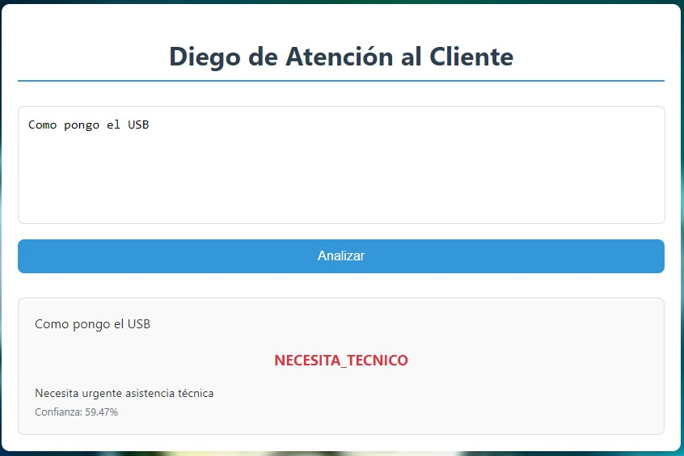
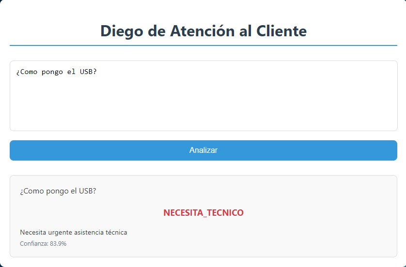
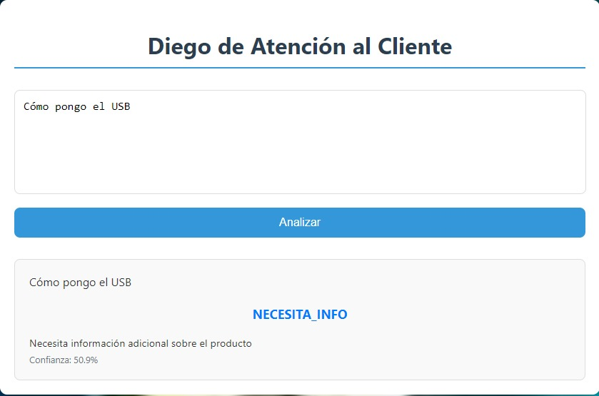
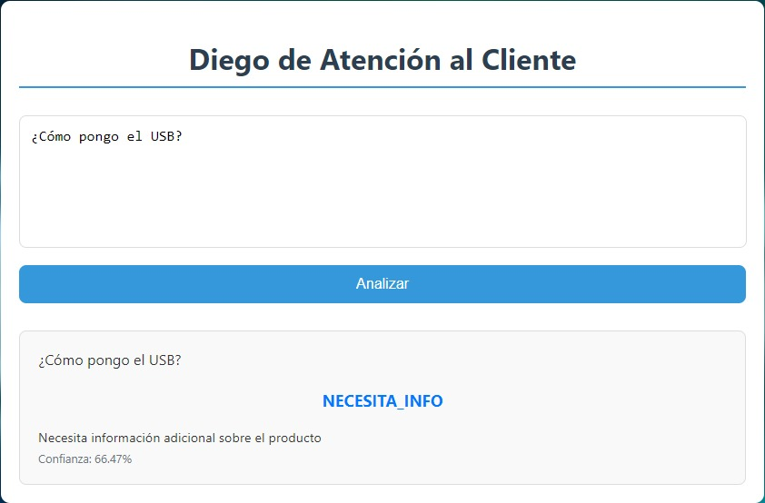

# Evaluación-Opiniones
En primer lugar hemos pasado los datos positivos de la IA anterior a esta, los cuales se pueden observar en varios dataset (dataset3.txt y dataset4.txt). Tras comprobar y comprender que eran mejor frases cortas para que la IA no tuviese tanto donde confundirse decidimos hacer las frases más cortas y poner menos para que no tuviese tanto sesgo, como se puede observar en el dataset.txt y en el dataset1FormatoCorregido.txt, el cual es una versión mejorada del anterior.

El que usamos actualmente para entrenar a la IA es el dataset1FormatoCorregido.txt con el cual en el PC de sobremesa con un procesador Intel Core i5 13600KF, ya que hacemos las ejecuciones con la CPU en vez de con la GPU que sería más rápida, pero la cual no hemos conseguido poner a trabajar probablemente por alguna configuración errónea. Con el procesador mencionado anteriormente hemos tardado un par de segundos en realizar el entrenamiento de este archivo, el cual cuenta con unas 1100 líneas, mientras que con otros con unas 4000 líneas nos tardaba de media unos 20 minutos sin modificar ningún atributo, modificando los parámetros de los Epochs y los Bachs nos tardaba menos de unos 10 minutos de media.

Hay que destacar que en el entrenamiento muchas de las frases de necesitar ayuda las propias IAs, a las que le hemos pedido los datos para no repetirnos, nos las han dado con el formato correcto de una pregunta en castellano, es decir, con los dos signos de interrogación y con tildes, por lo que al eliminar las tildes en algunas palabras nos va a dar un resultado alterno, por ejemplo el caso de la palabla **"COMO"** que al preguntar es con tilde y al añadirla en una frase común va sin la tilde.

## Ejemplos en las Ejecuciones
Vamos a ver un par de ejemplos de lo que nos referimos del entrenamiento de la IA con el tema de las tildes y de los signos.

### Caso sin tildes y sin signos

### Caso sin tildes y con signos

Ambos casos anteriores nos dan que se necesita un técnico cuando lo único que necesita el usuario es información, pero al no escribir correctamente la frase nos da este pequeño error.

### Caso con tildes y sin signos

### Caso con tildes y con signos

Como hemos podido observar en estos dos últimos ejemplos al poner correctamente las tildes ya nos valdría para que nos de correctamente el resultado, aunque con bastantes dudas, ya que la confianza de la IA es casi un 51%, sin embargo al poner tanto las tildes como los signos ese porcentaje de confianza sube estando más segura de que el usuario necesita información.
